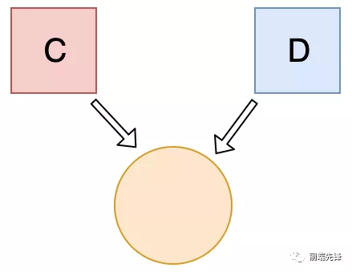

# 输出是什么？
```
let c = { greeting: 'Hey!' }
let d

d = c
c.greeting = 'Hello'
console.log(d.greeting)
```
    A: Hello

    B: undefined

    C: ReferenceError

    D: TypeError
在 JavaScript 中，当设置两个对象彼此相等时，它们会通过引用进行交互。

首先，变量 c 的值是一个对象。接下来，我们给 d 分配了一个和 c 对象相同的引用。  

  
因此当我们改变其中一个对象时，其实是改变了所有的对象。    

答案: A