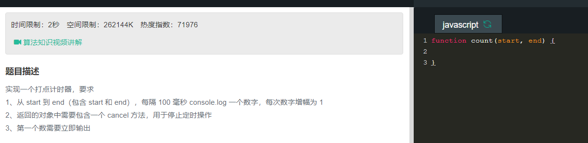

```
function count(start,end){
    console.log(start++);
    var timer = setInterval(function(){
        if(start<=end){
            console.log(start++);
        }else{
            clearInterval(timer);
        }
    },100);

    return {
        cancel:function(){
            clearInterval(timer);
        }
    }
}
```
```
function count(start,end){
    if(start<=end){
        console.log(start);
        start++;
        st = setTimeout(function(){
            count(start,end)
        },100);
    }

    return {
        cancel:function(){
            clearTimeout(st);
        }
    }
}
```