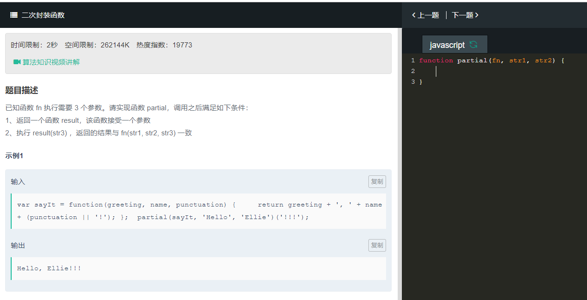

```
// call和apply必须显式地调用str3，立即执行
// bind不是立即执行，未传入str3时，并未执行，只是返回一个函数，等待参数传入
// this用于上下文不确定的情况

//call
function partial(fn,str1,str2){
    function result(str3){
        return fn.call(this,str1,str2,str3)
    }
    
    return result
}

// 这个bind会生成一个新函数（对象）, 它的str1, str2参数都定死了, str3未传入, 一旦传入就会执行
function partial(fn,str1,str2){
    return fn.bind(this,str1,str2)
}


// bind同上, 多了一步, 把str3传入的过程写在另一个函数里面,
// 而另一个函数也有str1, str2参数
// 此法有种多次一举的感觉，但是表示出了后续的调用。
function partial(fn,str1,str2){
    function result(str3){
        return fn.bind(this,str1,str2)(str3);
    }
    return result
}
```