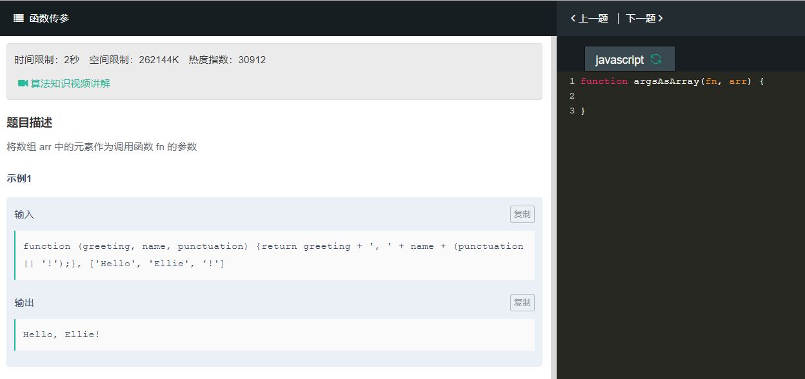
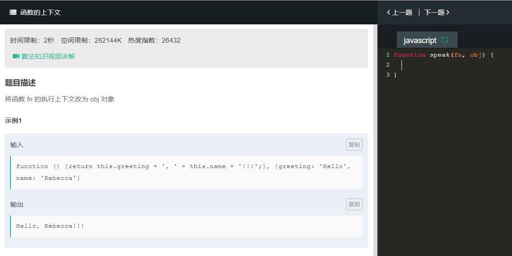

```
function argsAsArray(fn,arr){
    return fn.apply(this,arr);
}
```
调用函数可以使用call或者apply这两个方法，区别在于call需要将传递给函数的参数明确写出来，是多少参数就需要写多少参数。而apply则将传递给函数的参数放入一个数组中，传入参数数组即可。  


```
function speak(fn,obj){
    return fn.apply(obj,obj);
}
```
在JavaScript中，函数是一种对象，其上下文是可以变化的，对应的，函数内的this也是可以变化的，函数可以作为一个对象的方法，也可以同时作为另一个对象的方法，可以通过Function对象中的call或者apply方法来修改函数的上下文，函数中的this指针将被替换为call或者apply的第一个参数。将函数 fn 的执行上下文改为 obj 对象，只需要将obj作为call或者apply的第一个参数传入即可。
```
function speak(fn,obj){
    return fn.bind(obj)();
}
```
该bind()方法创建一个新函数，在调用时，将其this关键字设置为提供的值，并在调用新函数时提供任何前面提供的给定参数序列。