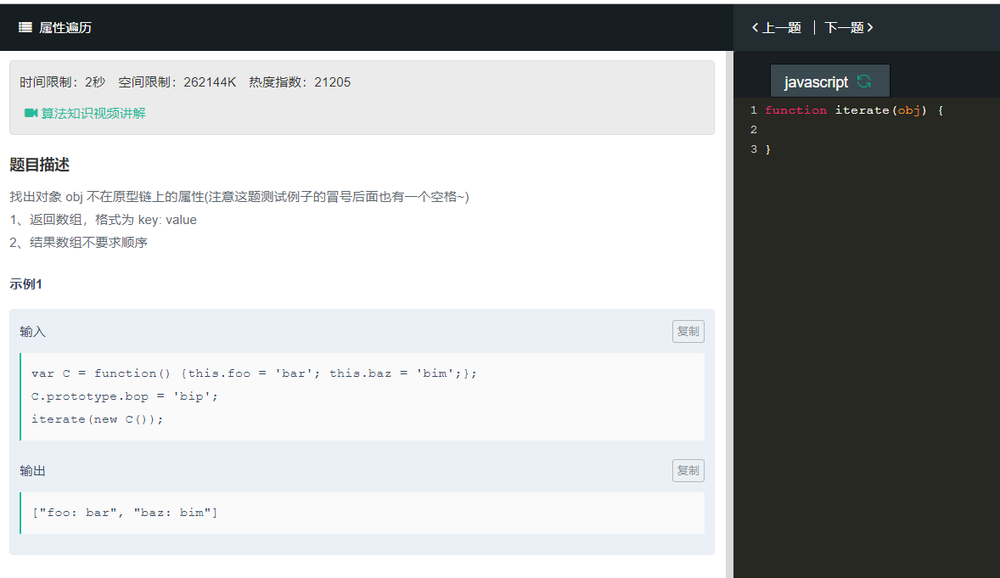

```
function iterate(obj){
    var arr = []
    //使用for-in遍历对象
    for(var key in obj){
        //判断key是否为对象本身的属性
        if(obj.hasOwnProperty(key)){
            //将属性和值按格式存入数组
            arr.push(key+": "+obj[key]);
        }
    }
    return arr;
}
```
可以使用for-in来遍历对象中的属性，hasOwnproperty方法能返回一个布尔值，指出一个对象是否具有指定名称的属性。此方法无法检查该对象的原型链中是否具有该属性，该属性必须为对象本身的属性。  
  
  hasOwnproperty方法是检测属性是存在实列中，还是存在原型中。存在对象实列中返回true ,for-in循环时，返回的是所有能够通过对象访问的属性（可枚举的属性）