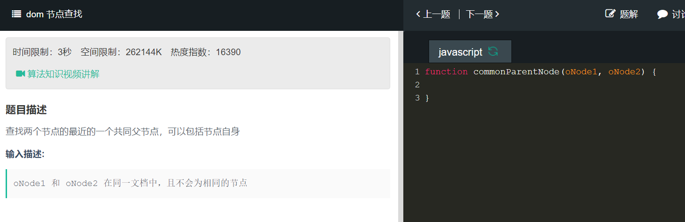

```
function commonParentNode(oNode1,oNode2){
    for(;oNode1;oNde1=oNode1.parentNode){
        if(oNode1.contains(oNode2)){
            return oNode1
        }
    }
}
```
parentNode 属性以 Node 对象的形式返回指定节点的父节点。如果指定节点没有父节点，则返回 null。  
Node.contains()返回的是一个布尔值，来表示传入的节点是否为该节点的后代节点。
```
function commonParentNode(oNode1,oNode2){
    if(oNode1.contains(oNode2)){
        return oNode1
    }else{
        return commonParentNode(oNode1.parentNode,oNode2)
    }
}
```