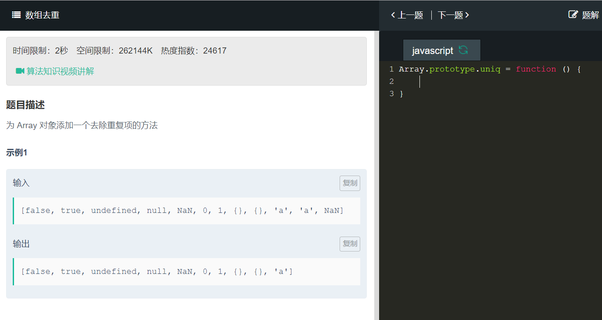

```
Array.prototype.uniq = function(){
    return [...new Set(this)]
}
```
```
Array.prototype.uniq = function(){
    var resArr = []
    var flag = true

    for(var i=0;i<this.length;i++){
        if(resArr.indexOf(this[i])==-1){
            if(this[i]!=this[i]){  //排除NaN
                if(flag){
                    resArr.push(this[i])
                    flag=false
                }
            }else{
                resArr.push(this[i])
            }
        }
    }
    return resArr
}
```
indexOf()方法返回在数组中可以找到一个给定元素的第一个索引，如果不存在，则返回-1。  
因为NaN!=NaN,所以resArr.indexOf（NaN）始终等于-1，那么resArr中就会认为NaN不存在，就把多个NaN都push进来，所以要区别对待NaN