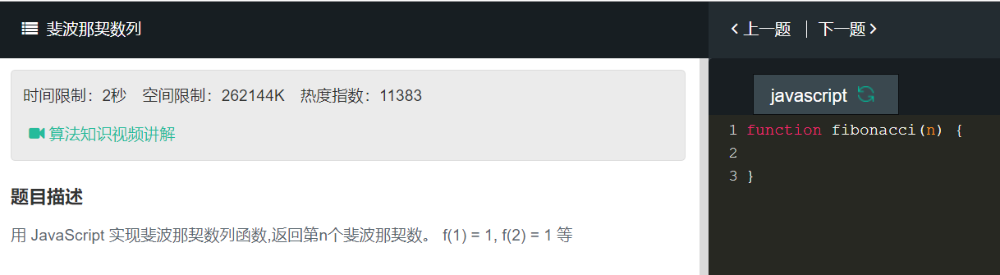
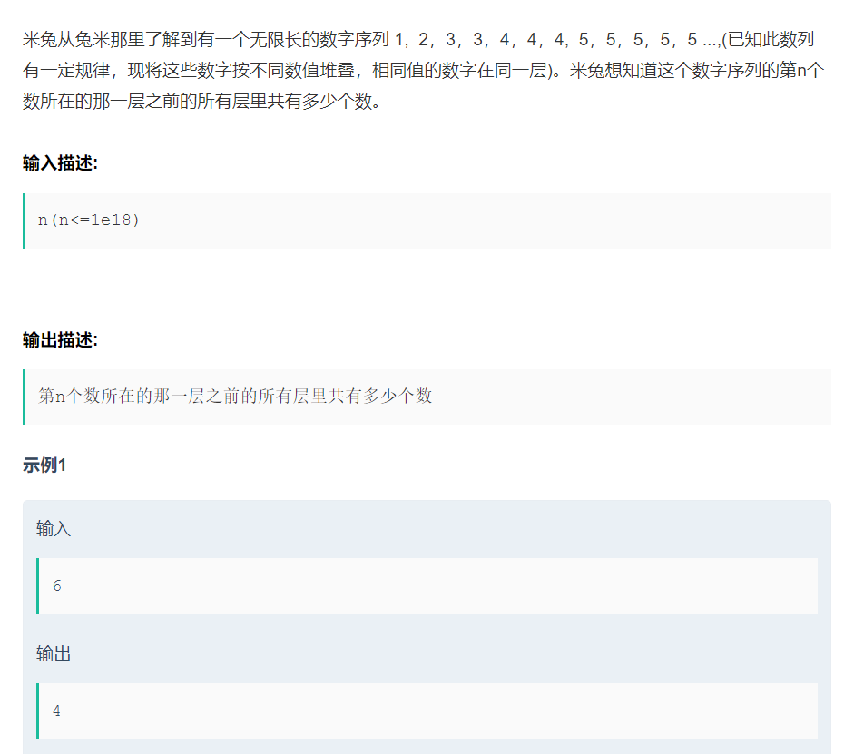

# 斐波那契数列
  

```
function fibonacci(n){
    if(n==1 || n==2){
        return 1
    }else{
        return fibonacci(n-1)+fibonacci(n-2)
    }
}
```
  

```
// 获取数字序列的第n个数所在的那一层之前的所有层里的数字个数之和
function getCount(n){
    let currentLayer = checkInwhichLayer(n)
    if(currentLayer<=1){
        return 0
    }else{
        return getTotalLayerCount(currentLayer-1)
    }
}

//获取某一层里的数字个数
function getLayerCount(layer){
    if(layer<1){
        return
    }else if(layer === 1 || layer === 2){
        return 1
    }else {
        return getLayerCount(layer-1)+getLayerCount(layer-2)
    }
}

//获取从第1层到第n层所有层里的数字个数总和
function getTotalLayerCount(layer){
    if(layer === 1)return 1;
    if(layer === 2)return 2;
    let sum = 0
    if(layer>2){
        for(let i = 1;i<=layer;i++){
            sum+=getLayerCount(i)
        }
    }
    return sum
}


// 检测第n个数在第几层
function checkInWhichLayer(n, layer = n) {
//     console.log("n: " + n)
//     console.log("layer: " + layer)
    if (n === 1) return 1;
 
    if (n > 1) {
      if (n < getTotalLayerCount(layer)) {
//         console.log("less than current layer count");
        if (n > getTotalLayerCount(layer - 1)) {
//           console.log("greater than previous layer count");
          return layer;
        } else if (n === getTotalLayerCount(layer - 1)){
//           console.log("equal to previous layer count");
          return layer - 1;
        } else {
          return checkInWhichLayer(n, layer - 1);
        }
      } else if (n === getTotalLayerCount(layer)) {
        return layer;
      }
  }
}
```