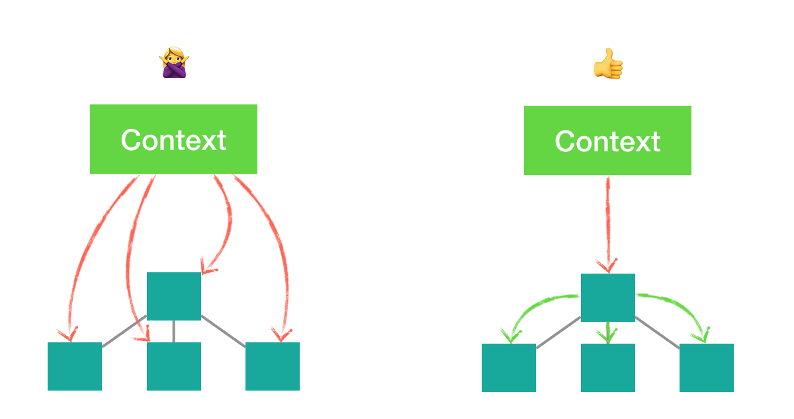

# 性能优化(Optimizing Performance)
## 使用生产版本
得到压缩

## 虚拟化长列表
- react-window
- react-virtualized

## shouldComponentUpdate的作用
决定DOM节点是否需要重新渲染  

```
class CounterButton extends React.Component {
  constructor(props) {
    super(props);
    this.state = {count: 1};
  }

  shouldComponentUpdate(nextProps, nextState) {
    if (this.props.color !== nextProps.color) {
      return true;
    }
    if (this.state.count !== nextState.count) {
      return true;
    }
    return false;
  }

  render() {
    return (
      <button
        color={this.props.color}
        onClick={() => this.setState(state => ({count: state.count + 1}))}>
        Count: {this.state.count}
      </button>
    );
  }
}
```

使用**React.PureComponent**进行props和state的**浅比较**，以此来决定组件是否需要更新  

```
class CounterButton extends React.PureComponent {
  constructor(props) {
    super(props);
    this.state = {count: 1};
  }

  render() {
    return (
      <button
        color={this.props.color}
        onClick={() => this.setState(state => ({count: state.count + 1}))}>
        Count: {this.state.count}
      </button>
    );
  }
}
```

## 不可变数据
```
function updateColorMap(colormap) {
    colormap.right = 'blue';
}
```

为了不改变原本的对象，使用Object.assign  

```
function updateColorMap(colormap) {
    return Object.assign({},colormap,{right:'blue'});
}
```

```
function updateColoeMap(colormap) {
    return {...colormap,right:'blue'}
}
```

## React性能优化的方向
- 减少计算量：对应到React中就是减少渲染的节点或者减低组件渲染的复杂度
  - 不要在渲染函数时进行不必要的计算：render中不要进行数组排序、数据转换、订阅事件、创建事件处理器等
  - 减少不必要的嵌套
  - 虚拟列表：本质就是减少渲染的节点
  - 惰性渲染：只在必要时去渲染对应的节点
  - 选择合适的样式方案：css > 大部分css-in-js > inline style
- 利用缓存：对应到React中就是如何避免重新渲染，利用函数式编程的memo方式来避免组件重新渲染(组件的纯粹性、shouldComponentUpdate)
  - 简化props：单一职责
  - 不变的事件处理器
  - 不可变的数据
  - 简化state：如果需要组件响应它的变动，或者需要渲染到视图中的数据才放到state中，避免不必要的数据变动导致组件重新渲染
- 精确重新计算的范围：对应到React中就是绑定组件和状态关系，精确判断更新的'时机'和'范围'，只重新渲染'脏'的组件，或者说减低渲染范围
  - 响应式数据的精细化渲染
  - 不要滥用Context  




### 不变的事件处理器
1. 避免使用箭头函数形式的事件处理器：每次渲染时都会创建一个新的事件处理器  

```
<ComplexComponent onClick={evt => onClick(evt.id)} otherProps={values} />

```
更好的方式
```
class MyComponent extends Component {
  render() {
    <ComplexComponent onClick={this.handleClick} otherProps={values}/>;
  }

  handleClick = () => {
    //...
  }
}
```
2. 使用useCallback来包裹事件处理器，**尽量给下级组件暴露一个静态的函数**

### 精细化渲染
只有一个数据来源导致组件重新渲染  
Vue和Mobx：定义一些'响应式数据'，当这些响应式数据变动时，依赖这些响应式数据视图就会重新渲染。
