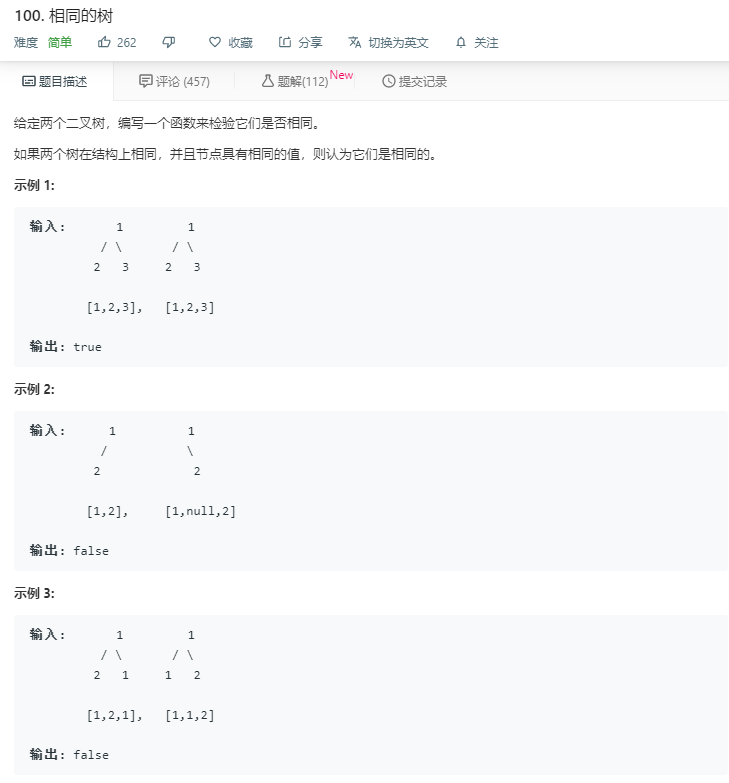

# 100.相同的树
  

```
/**
 * Definition for a binary tree node.
 * function TreeNode(val) {
 *     this.val = val;
 *     this.left = this.right = null;
 * }
 */
/**
 * @param {TreeNode} p
 * @param {TreeNode} q
 * @return {boolean}
 */
var isSameTree = function(p, q) {
    if((p==null && q!=null)||(p!=null && q==null)){
        return false;
    }
    let one=[],two=[],temp=[];
    function mid(root){
        if(root != null){
            temp.push(root.val);
            mid(root.left);
            mid(root.right);
        }
        temp.push(0);
    }

    mid(p);
    one = temp.slice(0);
    temp = [];
    mid(q);
    two = temp;
    console.log(one,two);
    let result = 0;
    one.forEach((ele,index)=>{
        if(one[index] != two[index]){
            result = 1;
        }
    })
    if(result == 1){
        return false;
    }
    return true;
};
```