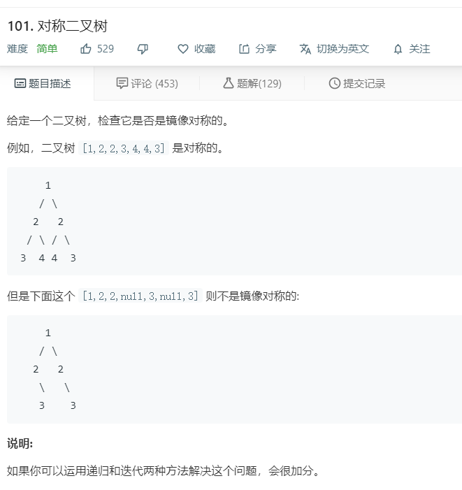

# 101.对称二叉树
  

```
/**
 * Definition for a binary tree node.
 * function TreeNode(val) {
 *     this.val = val;
 *     this.left = this.right = null;
 * }
 */
/**
 * @param {TreeNode} root
 * @return {boolean}
 */
var isSymmetric = function(root) {
    if(!root){
        return true;
    }

    return isrealy(root.left,root.right);
};

function isrealy(one,two){
    if(one == null && two == null){
        return true;
    }

    if(one == null || two == null){
        return false;
    }

    return one.val == two.val && isrealy(one.left,two.right) && isrealy(one.right,two.left);
}
```