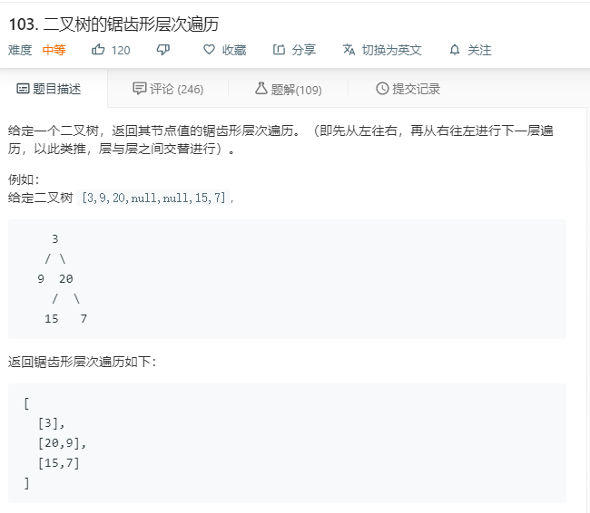

# 103.二叉树的锯齿形层次遍历
  

```
/**
 * Definition for a binary tree node.
 * function TreeNode(val) {
 *     this.val = val;
 *     this.left = this.right = null;
 * }
 */
/**
 * @param {TreeNode} root
 * @return {number[][]}
 */
var zigzagLevelOrder = function(root) {
    let temp = [];
    function abouthei(r,hei){
        if(r==null){
            return;
        }
        if(!temp[hei]){
            temp[hei] = [r.val];
        }else{
            temp[hei].push(r.val);
        }

         if(r.left){
            abouthei(r.left,hei+1);
        }
        if(r.right){
            abouthei(r.right,hei+1);
        }
    }

    abouthei(root,0);
    temp.forEach((el,index)=>{
        if(index%2 == 1){
            el = el.reverse();
        }
    })
    return temp;
};
```