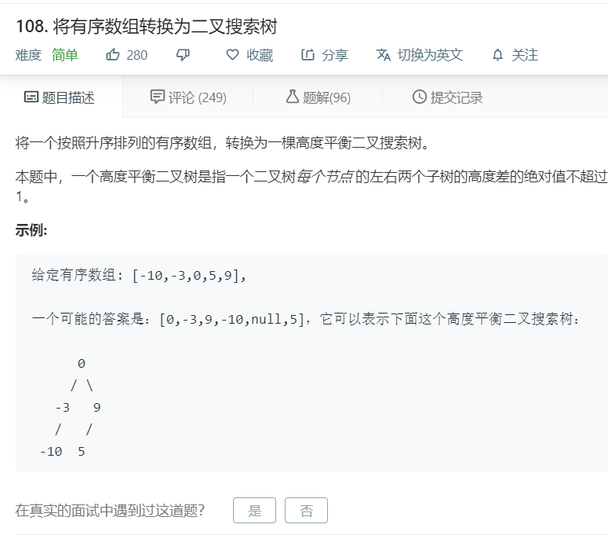

# 108.将有序数组转换为二叉搜索树
  

```
/**
 * Definition for a binary tree node.
 * function TreeNode(val) {
 *     this.val = val;
 *     this.left = this.right = null;
 * }
 */
/**
 * @param {number[]} nums
 * @return {TreeNode}
 */
var sortedArrayToBST = function(nums) {
    if(!nums || nums.length == 0){
        return null;
    }

    let mid = nums.length >> 1;

    let father = new TreeNode(nums[mid]);
    father.left = sortedArrayToBST(nums.slice(0,mid));
    father.right = sortedArrayToBST(nums.slice(mid+1,nums.length));

    return father;
};
```