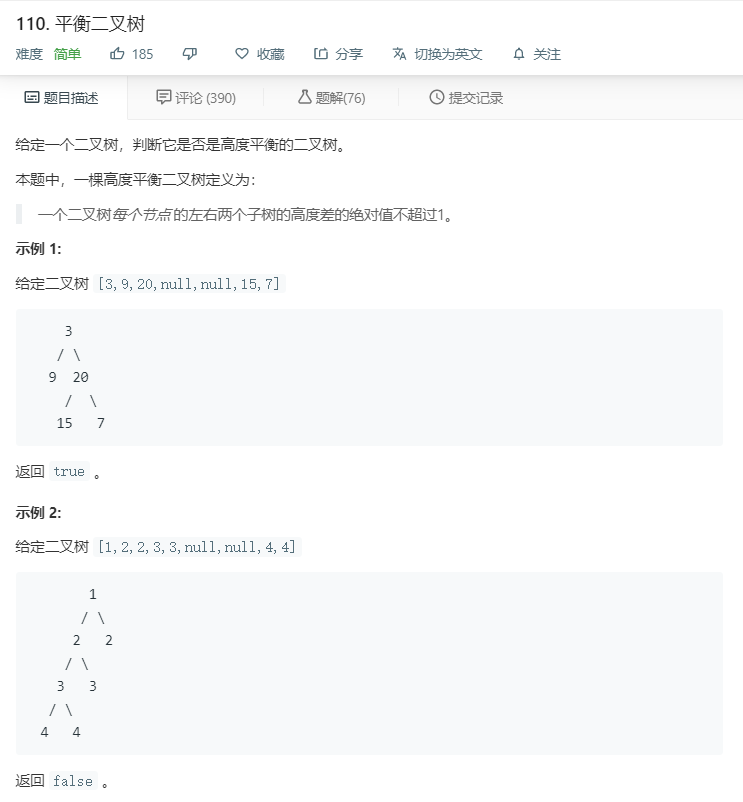

# 110.平衡二叉树
  

```
/**
 * Definition for a binary tree node.
 * function TreeNode(val) {
 *     this.val = val;
 *     this.left = this.right = null;
 * }
 */
/**
 * @param {TreeNode} root
 * @return {boolean}
 */
var isBalanced = function(root) {
    if(root == null){
        return true;
    }
    if(Math.abs(heights(root.left)-heights(root.right))>1){
        return false;
    }
    return isBalanced(root.left) && isBalanced(root.right);
};

function heights(r){
    if(r == null){
        return 0;
    }
    return Math.max(heights(r.left),heights(r.right))+1;
}
```