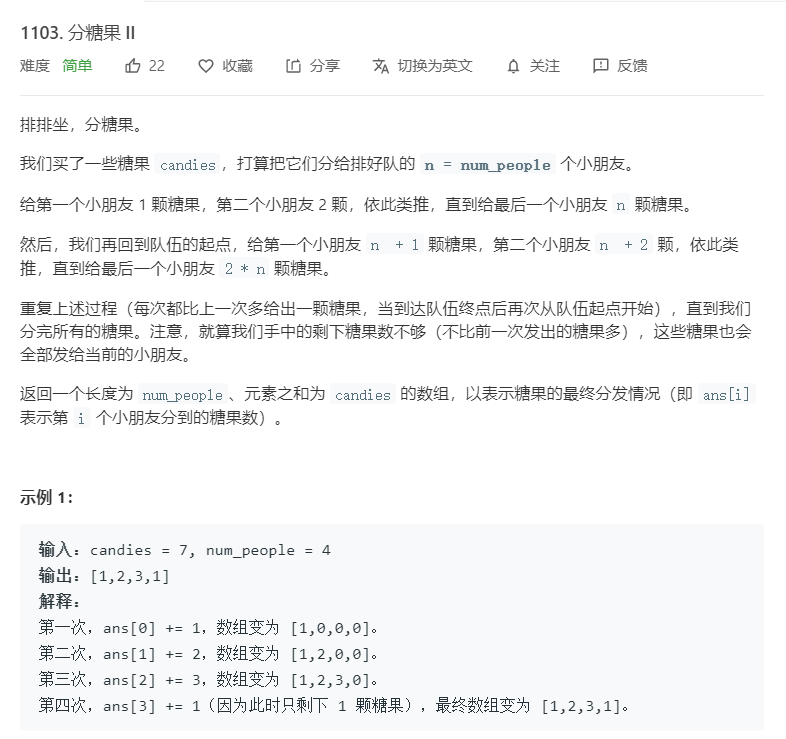
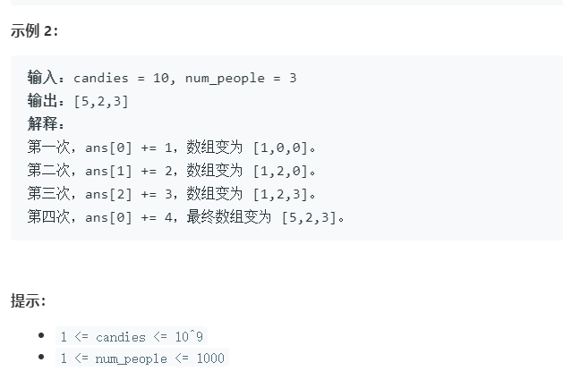

# 1103.分糖果II
  

  

```
/**
 * @param {number} candies
 * @param {number} num_people
 * @return {number[]}
 */
var distributeCandies = function(candies, num_people) {
    let result = new Array(num_people).fill(0),num = 1;
    console.log(result)
    while(candies > 0) {
        for(let i=0;i<num_people;i++){
            if(candies >= num){
                result[i] += num;
                candies -= num;
                num += 1;
            }else{
                result[i] += candies
                candies = 0;
            }
        }
    }
    return result;
};
```