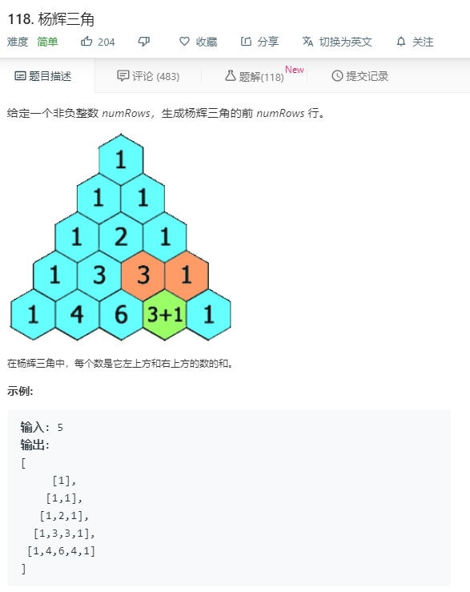

# 118.杨辉三角
  

```
/**
 * @param {number} numRows
 * @return {number[][]}
 */
var generate = function(numRows) {
  let result = [];
    for(let i=0;i<numRows;i++){
      let temp = [];
      for(let j=0;j<i+1;j++){
        if(j == 0 || j == i){
          temp.push(1);
        }
        else if(result.length >= 2){
          let nownum = result[i-1][j-1]+result[i-1][j];
          // console.log(result);
          temp.push(nownum);
        }
      }
      result.push(temp);
    }
    // console.log(result);
    return result;
};
```