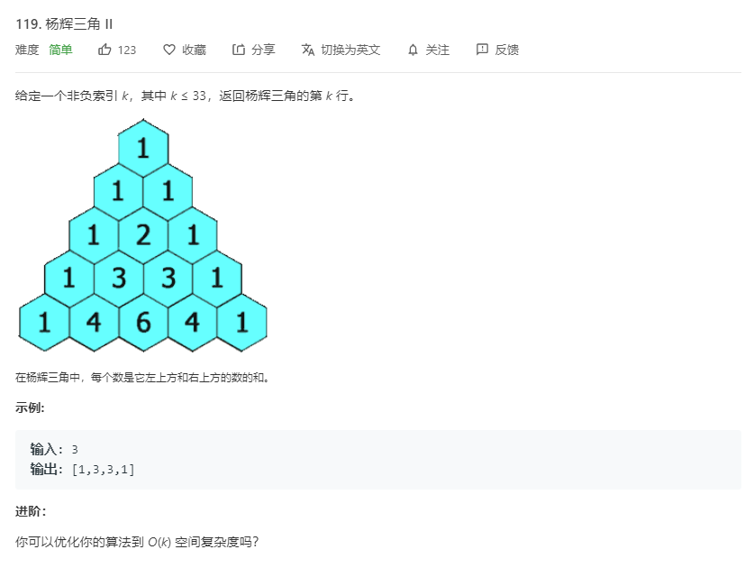

# 119.杨辉三角II
  

```
/**
 * @param {number} rowIndex
 * @return {number[]}
 */
var getRow = function(rowIndex) {
    if(rowIndex == 0){
        return [1];
    }

    let temp = new Array(rowIndex);
    for(let i=0;i<=rowIndex;i++){
        temp[i] = new Array(i+1);
    }

    temp[0][0] = 1;
    for(let i=1;i<=rowIndex;i++){
        temp[i][0] = 1;
        temp[i][temp[i].length-1] = 1;
    }

    for(let i=2;i<=rowIndex;i++){
        for(let j=1;j<temp[i].length-1;j++){
            temp[i][j] = temp[i-1][j-1]+temp[i-1][j];
        }
    }
    console.log(temp);
    return temp[rowIndex];
};
```