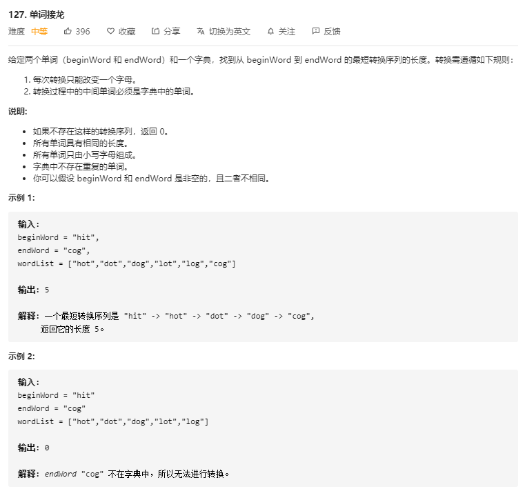

# 127.单词接龙
  

```
/**
 * @param {string} beginWord
 * @param {string} endWord
 * @param {string[]} wordList
 * @return {number}
 */
var ladderLength = function(beginWord, endWord, wordList) {
    if(!endWord || wordList.indexOf(endWord) < -1) {
        return 0;
    }
   let mid = {};

   let len = beginWord.length;

   for(let i=0;i<wordList.length;i++) {
       for(let j=0;j<len;j++) {
           let temp = wordList[i].substring(0,j) + '*' + wordList[i].substring(j+1, len);
           (!mid[temp]) && (mid[temp] = []);
           mid[temp].push(wordList[i]);
       }
   }

   console.log(mid);

   let queue = [[beginWord, 1]];
   let had = {beginWord:true};

   while(queue.length > 0) {
       let now = queue.shift();

       let value = now[0];
       let num = now[1];

       for(let i=0;i<len;i++) {
           let temp = value.substring(0,i) + '*' + value.substring(i+1, len);

           if(temp in mid) {
               let midNow = mid[temp];

               for(let j=0;j<midNow.length;j++) {
                   if(midNow[j] === endWord) {
                       return num + 1;
                   }

                   if(!had[midNow[j]]) {
                       had[midNow[j]] = true;
                       queue.push([midNow[j], num+1]);
                   }
               }
           }
       }
   }

   return 0;
};
```