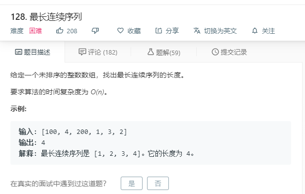

# 128.最长连续序列
  

```
/**
 * @param {number[]} nums
 * @return {number}
 */
var longestConsecutive = function(nums) {
    if(nums.length == 0){
        return 0;
    }
    nums.sort((a,b)=>a-b);
    nums = [...new Set(nums)]
    console.log(nums);
    let max = [],temp = [];
    for(let i=0;i<nums.length;i++){
        if(temp.length == 0){
            temp.push(nums[i]);
            if(i == nums.length-1){
                max.push(temp.length);
            }
        }else if(nums[i] == temp[temp.length-1]+1){
            temp.push(nums[i]);
            if(i == nums.length-1){
                max.push(temp.length);
            }
        }else{
            max.push(temp.length);
            temp = [];
            temp.push(nums[i]);
            if(i == nums.length-1){
                max.push(temp.length);
            }
        }
    }

    console.log(max);
    return Math.max(...max);
};
```