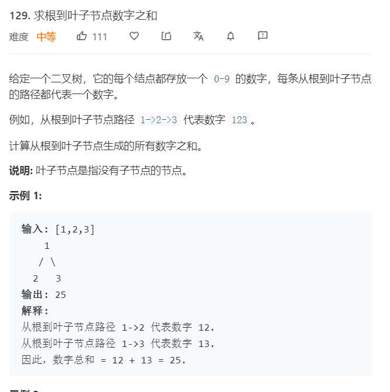

# 129.求根到叶子节点数字之和
  

```
/**
 * Definition for a binary tree node.
 * function TreeNode(val) {
 *     this.val = val;
 *     this.left = this.right = null;
 * }
 */
/**
 * @param {TreeNode} root
 * @return {number}
 */
var sumNumbers = function(root) {
    let temp = 0,list = [];

    let one = (root,list) => {
        if(root){
            list.push(root.val);
            if(!root.left && !root.right){
                console.log(list);
                temp += +list.join('');
                return;
            }
            one(root.left,list.slice());
            one(root.right,list.slice());
        }
    }

    one(root,list);
    return temp;
};
```