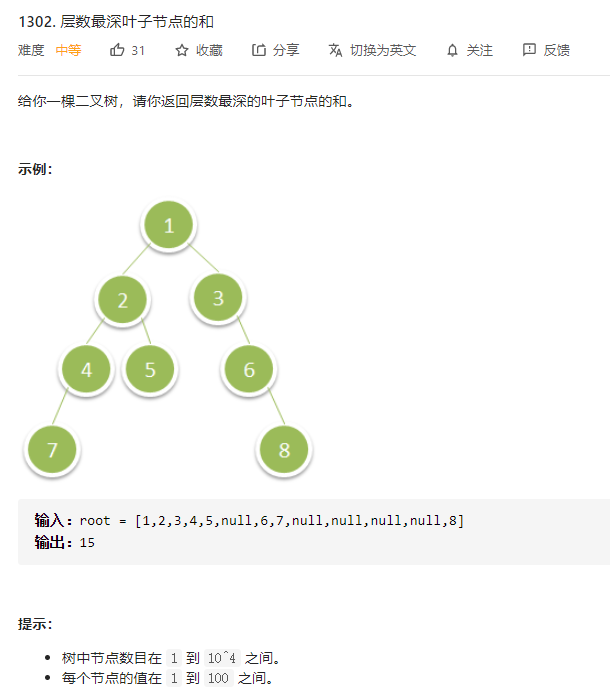

# 1302.层数最深叶子节点的和
  

```
/**
 * Definition for a binary tree node.
 * function TreeNode(val) {
 *     this.val = val;
 *     this.left = this.right = null;
 * }
 */
/**
 * @param {TreeNode} root
 * @return {number}
 */
var deepestLeavesSum = function(root) {
    let res = new Map(), max = -Infinity;

    const mid = (r, hei) => {
        if (r) {
            if (res.has(hei)) {
                let temp = res.get(hei).slice(0);
                temp.push(r.val);
                res.set(hei, temp);
            } else {
                res.set(hei, [r.val]);
            }

            if (hei > max) {
                max = hei;
            }

            mid(r.left, hei + 1);
            mid(r.right, hei + 1);
        }
    }

    mid(root, 0);

    // console.log(res)
    let nu = 0;

    res.get(max).map((el) => {
        nu += el;
    })

    return nu;
};
```