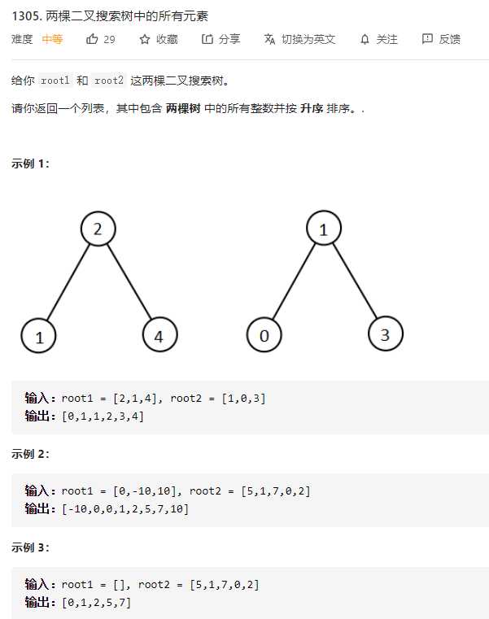

# 1305.两棵二叉搜索树中的所有元素
  

```
/**
 * Definition for a binary tree node.
 * function TreeNode(val) {
 *     this.val = val;
 *     this.left = this.right = null;
 * }
 */
/**
 * @param {TreeNode} root1
 * @param {TreeNode} root2
 * @return {number[]}
 */
var getAllElements = function(root1, root2) {
    let res = [];

    const mid = (r) => {
        if (r) {
            res.push(r.val);
            mid(r.left);
            mid(r.right);
        }
    }

    mid(root1);
    mid(root2);

    res.sort((a,b) => a-b);

    return res;
};
```