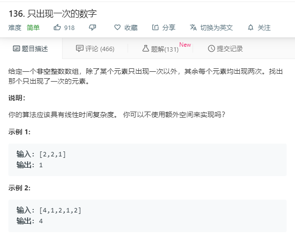

# 136.只出现一次的数字
  

```
/**
 * @param {number[]} nums
 * @return {number}
 */
var singleNumber = function(nums) {
    nums.sort((a,b)=>a-b);
    for(let i=0;i<nums.length;i++){
        if(i==0 && nums[i] != nums[i+1]){
            return nums[i];
        }
        if(i == nums.length-1 && nums[i] != nums[i-1]){
            return nums[i];
        }
        if(nums[i] != nums[i-1] && nums[i] != nums[i+1]){
            return nums[i];
        }

    }
};
```