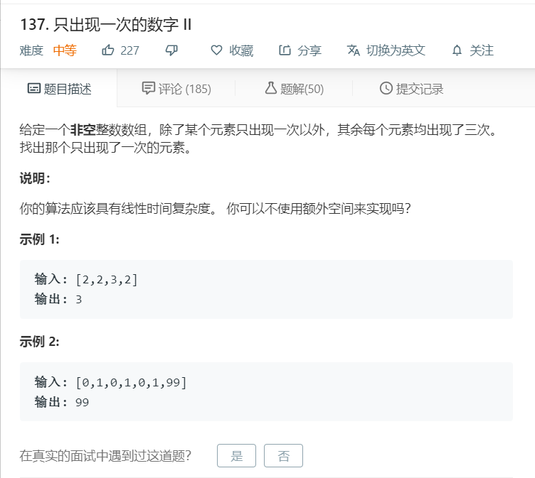

# 137.只出现一次的数字II.png
  

```
/**
 * @param {number[]} nums
 * @return {number}
 */
var singleNumber = function(nums) {
    for(let i=0;i<nums.length;i++){
        if(nums.indexOf(nums[i]) == nums.lastIndexOf(nums[i])){
            return nums[i];
        }
    }
};
```