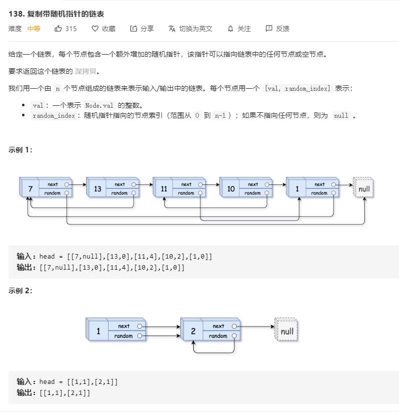
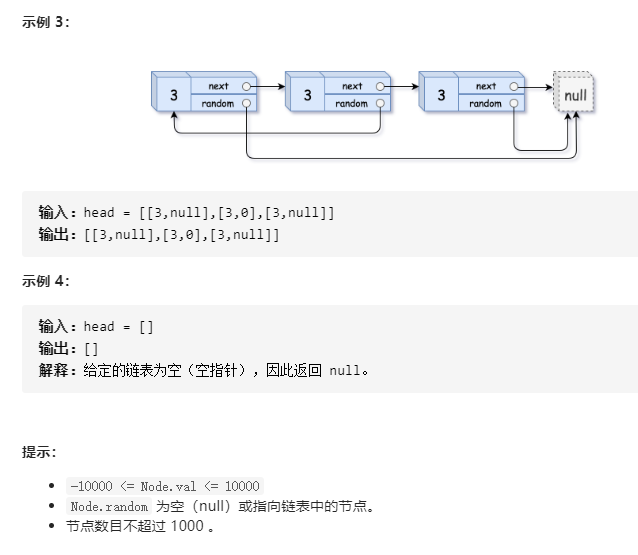

# 138.复制带随机指针的链表
  

  


```
/**
 * // Definition for a Node.
 * function Node(val, next, random) {
 *    this.val = val;
 *    this.next = next;
 *    this.random = random;
 * };
 */
/**
 * @param {Node} head
 * @return {Node}
 */
var copyRandomList = function(head) {
    if(!head) {
        return null;
    }
    let res = new Node();
    let one = head, two = res;
    let map = new Map();

    while(one) {
        two.val = one.val;
        two.next = one.next ? new Node() : null;
        map.set(one, two);
        one = one.next;
        two = two.next;
    }

    one = head;
    two = res;

    while(one) {
        two.random = one.random ? map.get(one.random) : null;
        one = one.next;
        two = two.next;
    }

    return res;
};
```