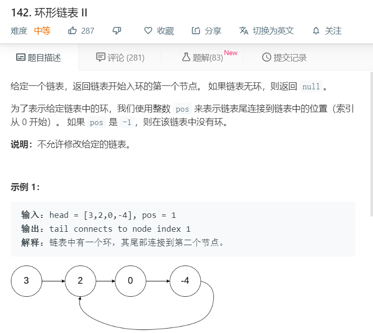
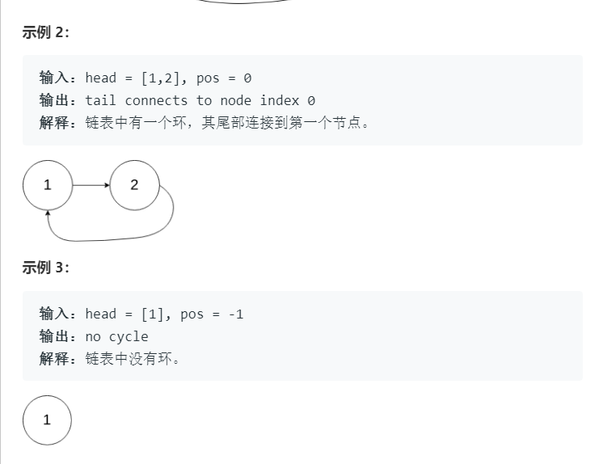

# 142.环形链表II
  

  

```
/**
 * Definition for singly-linked list.
 * function ListNode(val) {
 *     this.val = val;
 *     this.next = null;
 * }
 */

/**
 * @param {ListNode} head
 * @return {ListNode}
 */
var detectCycle = function(head) {
    if(!head || !head.next){
        return null;
    }

    let temp = [],result;
    while(head){
        if(temp.indexOf(head)>=0){
            result =  head;
            break;
        }else{
            temp.push(head);
        }
        head = head.next;
    }
    if(result){
        return result;
    }else{
        return null;
    }
};
```

## Set
```
/**
 * Definition for singly-linked list.
 * function ListNode(val) {
 *     this.val = val;
 *     this.next = null;
 * }
 */

/**
 * @param {ListNode} head
 * @return {ListNode}
 */
var detectCycle = function(head) {
    let mySet = new Set();

    while(head) {
        if (mySet.has(head)) {
            for (let [key, value] of mySet.entries()) {
                // console.log(key, value);
                if (head === value) {
                    return key;
                }
            }
        }

        mySet.add(head);
        head = head.next;
    }

    return null;
};
```