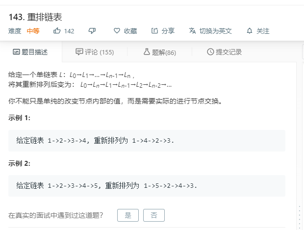

# 143.重排链表
  

```
/**
 * Definition for singly-linked list.
 * function ListNode(val) {
 *     this.val = val;
 *     this.next = null;
 * }
 */
/**
 * @param {ListNode} head
 * @return {void} Do not return anything, modify head in-place instead.
 */
var reorderList = function(head) {
    if(!head){
        return null;
    }
    let temp = [];
    while(head){
        temp.push(head);
        head = head.next;
    }

    let mid;

    if(temp.length % 2 == 0){
        mid = temp.length >> 1;
    }else{
        mid = temp.length >> 1;
        mid += 1;
    }

    let result = [];
    let leng = temp.length;
    let one = temp.splice(mid);
    for(let i=0;i<leng;i++){
        if(i % 2 == 0){
            result.push(temp.shift());
        }else{
            result.push(one.pop());
        }
    }

    for(let i=0;i<leng-1;i++){
        result[i].next = result[i+1];
    }
    result[leng-1].next = null;
    return result[0];
};
```