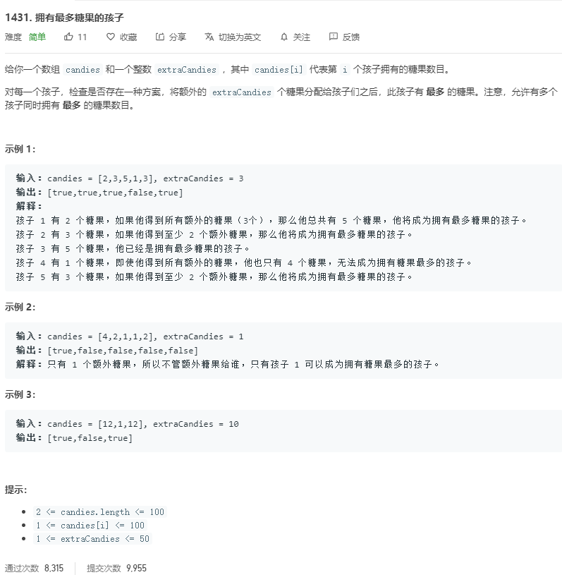

# 1431.拥有最多糖果的孩子
  

```
/**
 * @param {number[]} candies
 * @param {number} extraCandies
 * @return {boolean[]}
 */
var kidsWithCandies = function(candies, extraCandies) {
    let temp = new Array(candies.length).fill(false);

    let max = Math.max(...candies);

    candies.map((el,index) => {
        if(el + extraCandies >= max) {
            temp[index] = true;
        } 
    })

    return temp;
};
```