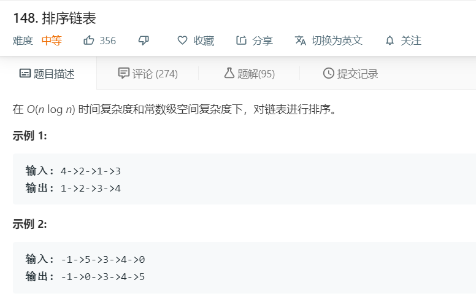

# 148.排序链表
  

```
/**
 * Definition for singly-linked list.
 * function ListNode(val) {
 *     this.val = val;
 *     this.next = null;
 * }
 */
/**
 * @param {ListNode} head
 * @return {ListNode}
 */
var sortList = function(head) {
    if(!head){
        return null;
    }
    let temp = [];
    while(head){
        temp.push(head.val);
        head = head.next;
    }

    temp.sort((a,b)=>a-b);
    for(let i=0;i<temp.length;i++){
        temp[i] = new ListNode(temp[i]);
    }

    for(let i=0;i<temp.length;i++){
        if(i==temp.length-1){
            temp[i].next = null;
        }else{
            temp[i].next = temp[i+1];
        }
    }

    console.log(temp);
    return temp[0];

};
```