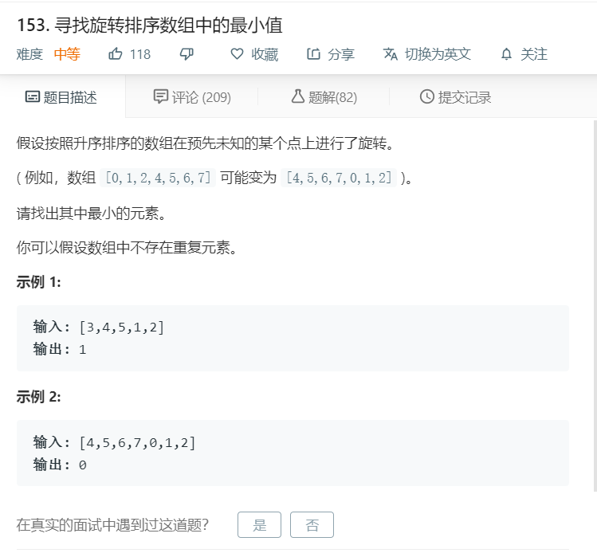

# 153.寻找旋转排序数组中的最小值
  

```
/**
 * @param {number[]} nums
 * @return {number}
 */
var findMin = function(nums) {
    if(nums.length == 0){
        return ;
    }
    let min = null;
    for(let i=0;i<nums.length-1;i++){
        if(nums[i+1]<nums[i]){
            min = nums[i+1];
            return min;
        }
    }
    return nums[0];
};
```