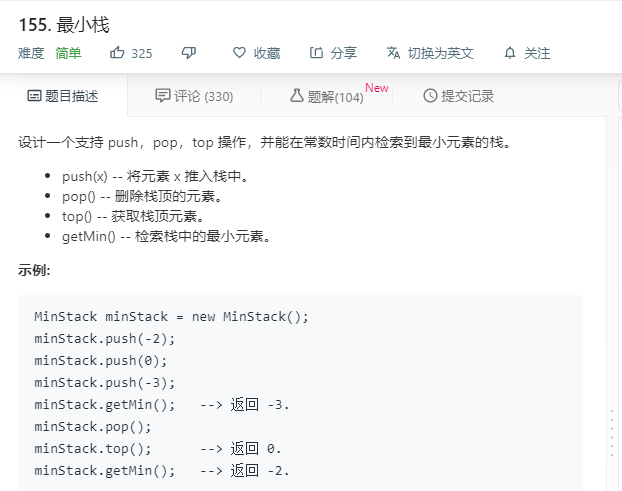

# 155.最小栈
  

```
/**
 * initialize your data structure here.
 */
var MinStack = function() {
    this.data = [];
};

/** 
 * @param {number} x
 * @return {void}
 */
MinStack.prototype.push = function(x) {
    this.data.push(x);
};

/**
 * @return {void}
 */
MinStack.prototype.pop = function() {
    this.data.pop();
};

/**
 * @return {number}
 */
MinStack.prototype.top = function() {
    return this.data[this.data.length-1]; 
};

/**
 * @return {number}
 */
MinStack.prototype.getMin = function() {
    return Math.min(...this.data);
};

/** 
 * Your MinStack object will be instantiated and called as such:
 * var obj = new MinStack()
 * obj.push(x)
 * obj.pop()
 * var param_3 = obj.top()
 * var param_4 = obj.getMin()
 */
```