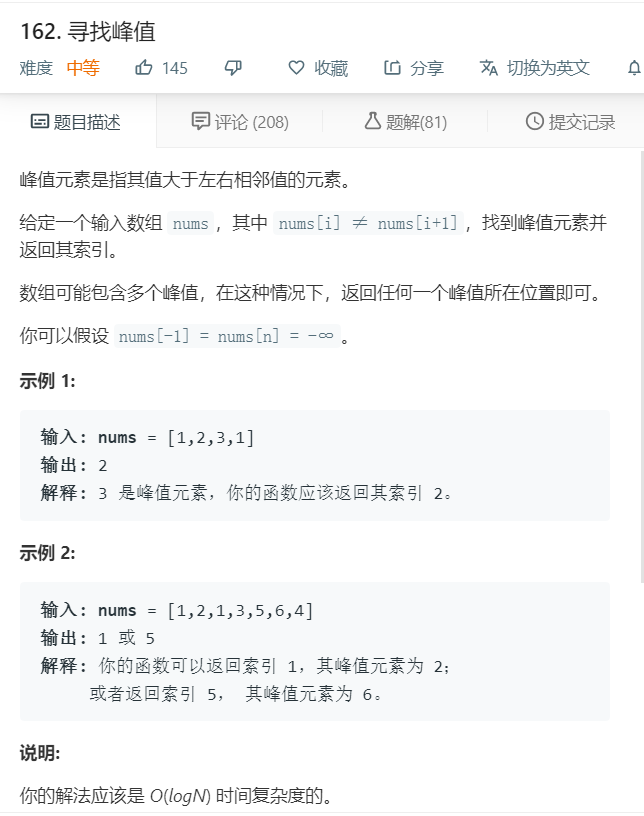

# 162.寻找峰值
  

```
/**
 * @param {number[]} nums
 * @return {number}
 */
var findPeakElement = function(nums) {
    let temp = [];
    if(nums.length<2){
        return 0;
    }
    for(let i=1;i<nums.length-1;i++){
        if(nums[i] > nums[i-1] && nums[i] > nums[i+1]){
            return i;
        }
    }
    if(nums[nums.length-1]>nums[nums.length-2]){
        return nums.length-1;
    }
    return 0;
};
```