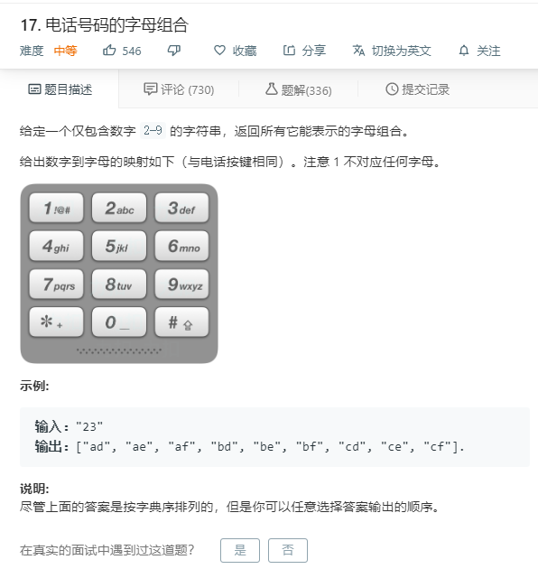

# 17.电话号码的字母组合
  

```
/**
 * @param {string} digits
 * @return {string[]}
 */
var letterCombinations = function(digits) {
    let mate = {
        '2':['a','b','c'],
        '3':['d','e','f'],
        '4':['g','h','i'],
        '5':['j','k','l'],
        '6':['m','n','o'],
        '7':['p','q','r','s'],
        '8':['t','u','v'],
        '9':['w','x','y','z']
    };

    let temp = digits.split('');

    let one = [],result=[];

    for(let i=0;i<temp.length;i++){
        one.push(mate[temp[i]]);
    }

    for(let i=0;i<one.length;i++){
        if(result.length == 0){
            one[i].forEach((el)=>{
                result.push([el]);
            })
        }else{
            let two = [];
           one[i].forEach((el)=>{
               result.forEach((ele)=>{
                   two.push(ele.concat(el));
               })
            }) 
            result = null;
            result = two.slice(0);
        }
    }

    result.forEach((el,index)=>{
        result[index] = el.join('');
    })

    console.log(result);
    return result;
    
};
```