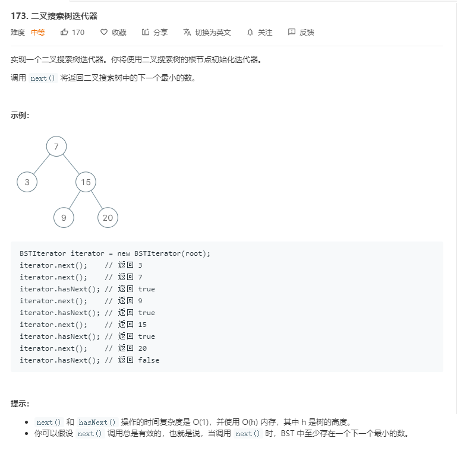

# 173.二叉搜索树迭代器
  

```
/**
 * Definition for a binary tree node.
 * function TreeNode(val) {
 *     this.val = val;
 *     this.left = this.right = null;
 * }
 */
/**
 * @param {TreeNode} root
 */
var BSTIterator = function(root) {
    this.temp = [];
    const mid = (r) => {
        if(r) {
            this.temp.push(r.val);
            mid(r.left);
            mid(r.right);
        }else{
            return ;
        }
    }

    mid(root);
    this.temp.sort((a,b)=>a-b);
    console.log(this.temp);
};

/**
 * @return the next smallest number
 * @return {number}
 */
BSTIterator.prototype.next = function() {
    return this.temp.shift();
};

/**
 * @return whether we have a next smallest number
 * @return {boolean}
 */
BSTIterator.prototype.hasNext = function() {
    return this.temp.length > 0;
};

/** 
 * Your BSTIterator object will be instantiated and called as such:
 * var obj = new BSTIterator(root)
 * var param_1 = obj.next()
 * var param_2 = obj.hasNext()
 */
```