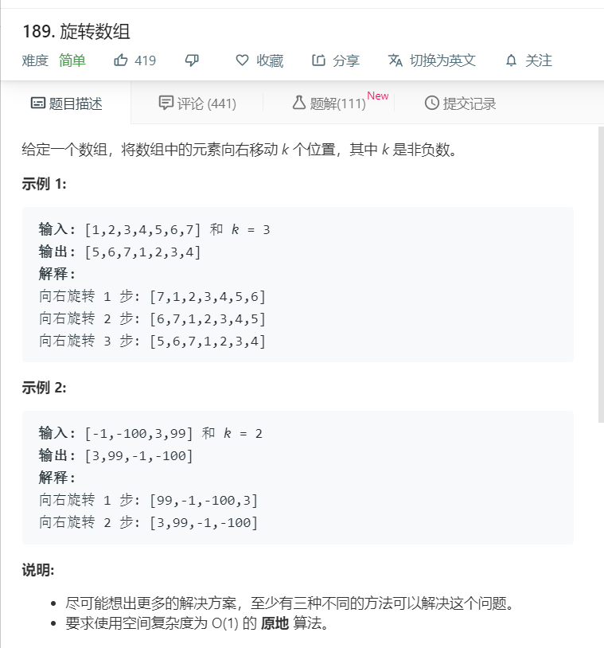

# 189.旋转数组
  

```
/**
 * @param {number[]} nums
 * @param {number} k
 * @return {void} Do not return anything, modify nums in-place instead.
 */
var rotate = function(nums, k) {
    if(nums.length < k){
      k = k % nums.length;
      nums.push(...nums.splice(0,nums.length-k));
    }else{
      nums.push(...nums.splice(0,nums.length-k));
    }
    // console.log(nums);
    // return nums;
};

```