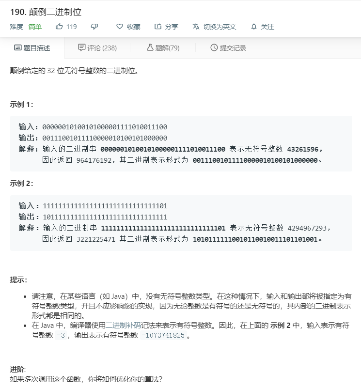

# 190.颠倒二进制位
  

```
/**
 * @param {number} n - a positive integer
 * @return {number} - a positive integer
 */
var reverseBits = function(n) {
    let temp = (n.toString(2)+'').split('');
    if(temp.length<32){
        let now = [];
        for(let i=0;i<32-temp.length;i++){
            now.push(0);
        }
        temp = [...now,...temp];
    }
    let result = parseInt((temp.reverse().join('')),2);
    return result;
};
```