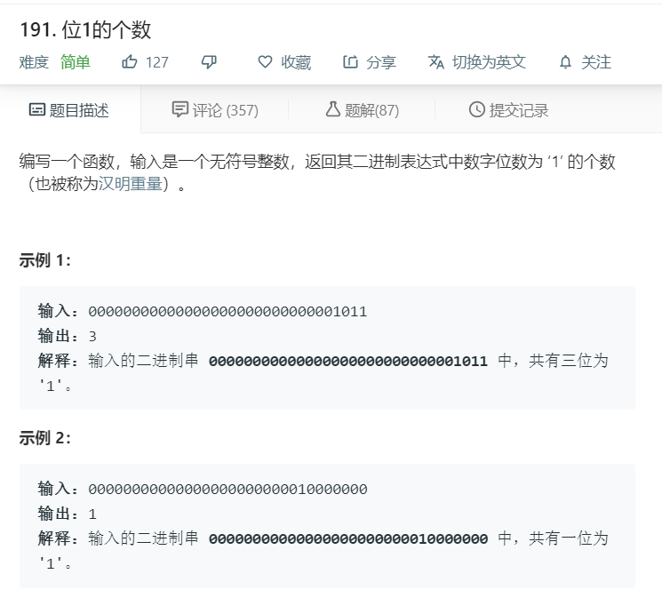
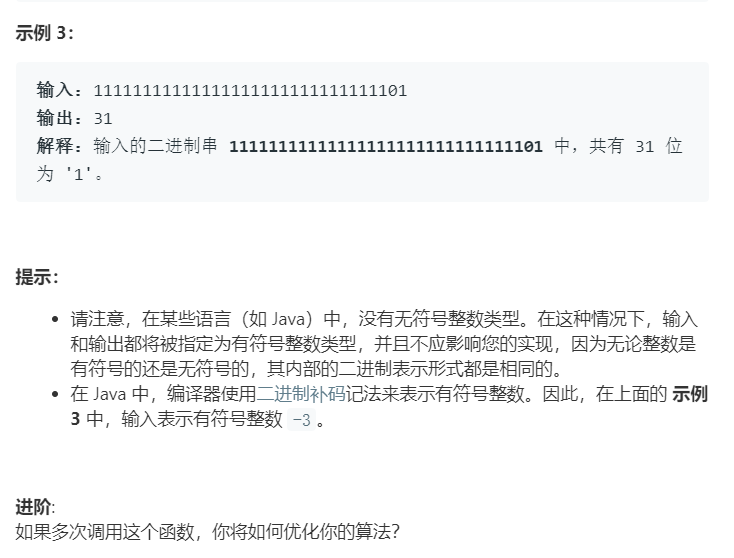

# 191.位1的个数
  

  

```
/**
 * @param {number} n - a positive integer
 * @return {number}
 */
var hammingWeight = function(n) {
    let temp = n.toString(2);
    let result = (temp+'').split('');
    let one = 0;
    result.forEach((el)=>{
        if(el == '1'){
            one += 1;
        }
    })
    console.log(one);
    return one;
};
```