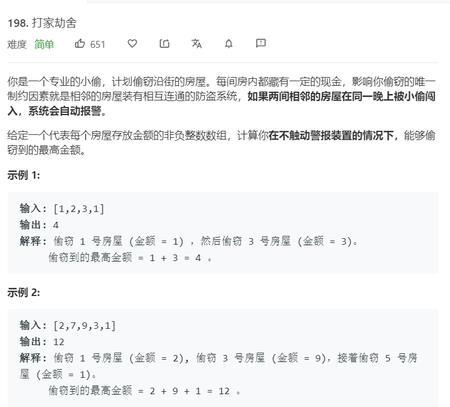

# 198.打家劫舍
  

```
/**
 * @param {number[]} nums
 * @return {number}
 */
var rob = function(nums) {
    let length = nums.length;
    if(length == 0){
        return 0;
    }

    let temp = new Array(length+1);
    //temp[i]表示抢到第 i 个房子可以获得的最大值
    temp[0] = 0;
    temp[1] = nums[0];

    for(let i=2;i<=length;i++){
        //如果我们抢第 i 个房子，那么我们就只能去考虑第 i – 2 个房子，
        //如果不抢，那么我们可以考虑第 i – 1 个房子
        temp[i] = Math.max(temp[i-2]+nums[i-1],temp[i-1]);
    }

    console.log(temp);
    return temp.pop();
};
```