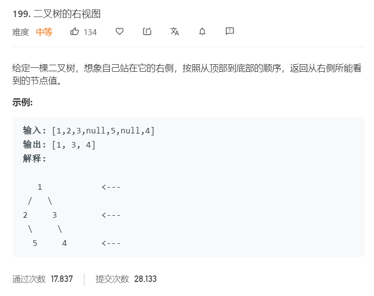

# 199.二叉树的右视图
  

```
/**
 * Definition for a binary tree node.
 * function TreeNode(val) {
 *     this.val = val;
 *     this.left = this.right = null;
 * }
 */
/**
 * @param {TreeNode} root
 * @return {number[]}
 */
var rightSideView = function(root) {
    if(!root){
        return [];
    }
    let temp = [root],result = [];

    while(temp.length){
        let one = [],two = [];

        while(temp.length){
            let now = temp.shift();
            one.push(now.val);

            if(now.left){
                two.push(now.left);
            }

            if(now.right){
                two.push(now.right);
            }
        }

        result.push(one);
        temp = two;
    }

    result.forEach((el,index)=>{
        let now = el.pop();
        result[index] = now;
    })

    return result;
};
```

## 深度遍历
 利用 BFS 进行层次遍历，记录下每层的最后一个元素
```
/**
 * Definition for a binary tree node.
 * function TreeNode(val) {
 *     this.val = val;
 *     this.left = this.right = null;
 * }
 */
/**
 * @param {TreeNode} root
 * @return {number[]}
 */
var rightSideView = function(root) {
    if(!root){
        return [];
    }
    let result = [],temp = [root];

    while(temp.length > 0){
        let mid = [],nextemp = [];
        while(temp.length > 0){
            let now = temp.shift();
            mid.push(now.val);
            if(now.left){
                nextemp.push(now.left);
            }

            if(now.right){
                nextemp.push(now.right);
            }
        }
        result.push(mid);
        temp = nextemp.slice();
    }

    console.log(result);
    result.map((el,index)=>{
        result[index] = el.pop();
    })

    return result;
};
```