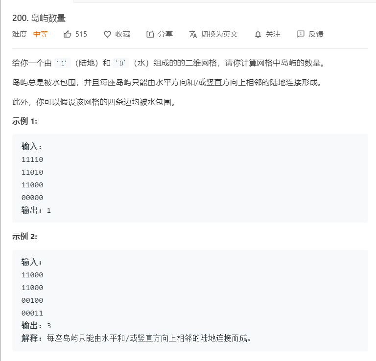

# 200.岛屿数量
  

```
/**
 * @param {character[][]} grid
 * @return {number}
 */
var numIslands = function(grid) {
    let temp = [];
    if(grid.length == 0){
        return 0;
    }
    let m = grid.length,n = grid[0].length;
    for(let i=0;i<m;i++){
        for(let j=0;j<n;j++){
            if(grid[i][j] == '1'){
                temp.push(i + '*' + j);
            }
        }
    }

    console.log(temp);
    let mate = [[1,0],[-1,0],[0,1],[0,-1]];

    let number = 0;

    let one = (i,j) => {
        // console.log(i,j,temp);
        for(let e=0;e<4;e++){
            let tempi = +(mate[e][0] + i);
            let tempj = +(mate[e][1] + j);
            let only = tempi + '*' + tempj;
            let position = temp.indexOf(only);
            if(tempi >= 0 && tempi < m 
                && tempj >= 0 && tempj < n
                && position >= 0){
                temp.splice(position,1);
                one(tempi,tempj);
            }
        }
    }

    while(temp.length > 0){
        console.log(temp);
        ++number;
        let now = temp.pop();
        now = now.split('*');
        one(+now[0],+now[1]);
    }

    return number;
};
```

```
/**
 * @param {character[][]} grid
 * @return {number}
 */
var numIslands = function(grid) {
    if(!grid || grid.length == 0 || grid[0].length == 0) {
        return 0;
    }

    let x = [-1, 0, 1, 0],
        y = [0, -1, 0, 1],
        m = grid.length,
        n = grid[0].length;

    let res = 0;

    const mid = (grid, nowx, nowy) => {
        if(nowx < 0 || nowx >= m || nowy < 0 || nowy >= n || grid[nowx][nowy] != 1) {
            return ;
        }

        grid[nowx][nowy] = "0";

        x.map((el,index) => {
            mid(grid, nowx + el, nowy + y[index]);
        })
    }
    for(let i=0;i<m;i++) {
        for(let j=0;j<n;j++) {
            if(grid[i][j] === "1") {
                mid(grid, i, j);
                res++;
            }
        }
    }

   return res;
};
```