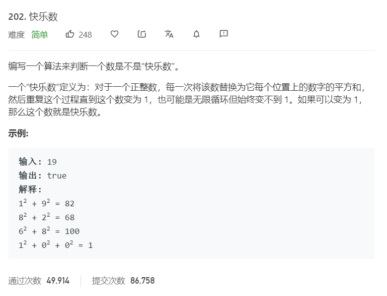

# 202.快乐数
  

## 快慢指针
```
/**
 * @param {number} n
 * @return {boolean}
 */
var isHappy = function(n) {
   let one = (nn) => {
       let now = 0;
       while(nn > 0){
           let temp = nn % 10;
           now += Math.pow(temp,2);
           nn = Math.floor(nn / 10);
       }
       return now;
   }

   let slow = n,fast = n;
   do{
       slow = one(slow);
       fast = one(fast);
       fast = one(fast);
   }while(slow != fast)

   return slow == 1;
};
```

## set的使用
```
/**
 * @param {number} n
 * @return {boolean}
 */
var isHappy = function(n) {
   let result = new Set();
   while(n != 1){
       let temp = 0,now = 0;
       while(n > 0){
           temp = n % 10;
           now += Math.pow(temp,2);
           n = Math.floor(n/10);
       }

       if(result.has(now)){
           console.log(result,now)
           return false;
       }

       result.add(now);
       n = now;
   }

   return true;
};
```