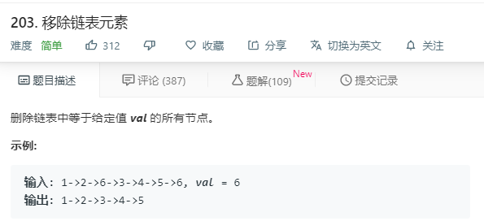

# 203.移除链表元素
  

```
/**
 * Definition for singly-linked list.
 * function ListNode(val) {
 *     this.val = val;
 *     this.next = null;
 * }
 */
/**
 * @param {ListNode} head
 * @param {number} val
 * @return {ListNode}
 */
var removeElements = function(head, val) {
    let temp = head;
    while(head && head.val == val){
        head = head.next;
        temp = head;
    }
    while(head){
        while(head.next && head.next.val == val && head.next.next){
            head.next = head.next.next;
        }
        while(head.next && head.next.val == val && !head.next.next){
            head.next = null;
        }
        head = head.next;
    }
    return temp;
};
```