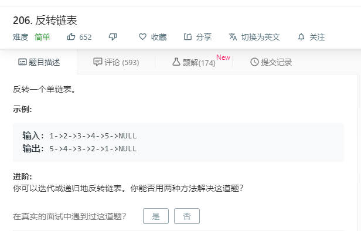

# 206.反转链表
  

```
/**
 * Definition for singly-linked list.
 * function ListNode(val) {
 *     this.val = val;
 *     this.next = null;
 * }
 */
/**
 * @param {ListNode} head
 * @return {ListNode}
 */
var reverseList = function(head) {
    let pre = null;
    let temp = null;
     while(head){
        temp = head.next;
        head.next = pre;
        pre = head;
        head = temp;
     }
     return pre;
};
```
```
/**
 * Definition for singly-linked list.
 * function ListNode(val) {
 *     this.val = val;
 *     this.next = null;
 * }
 */
/**
 * @param {ListNode} head
 * @return {ListNode}
 */
var reverseList = function(head) {
    let cur = head, pre = null;
    while(cur) {
        [cur.next, cur, pre] = [pre, cur.next, cur];
    }

    return pre;
};
```