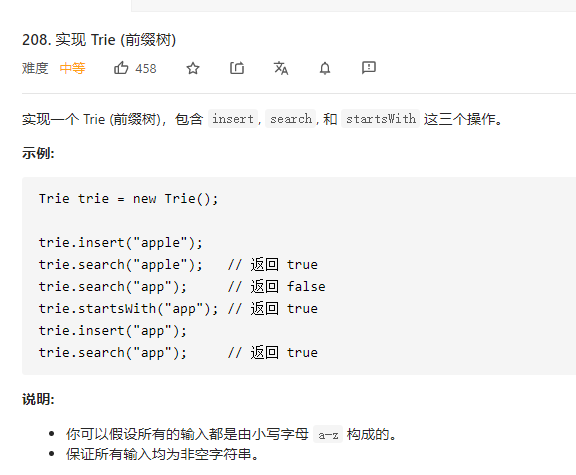

# 208.实现Trie前缀树
  

```
/**
 * Initialize your data structure here.
 */
var Trie = function() {
    this.all = [];
};

/**
 * Inserts a word into the trie. 
 * @param {string} word
 * @return {void}
 */
Trie.prototype.insert = function(word) {
    this.all.push(word);
};

/**
 * Returns if the word is in the trie. 
 * @param {string} word
 * @return {boolean}
 */
Trie.prototype.search = function(word) {
    let can = false;

    this.all.map((el) => {
        if (el === word) {
            can = true;
        }
    })

    return can;
};

/**
 * Returns if there is any word in the trie that starts with the given prefix. 
 * @param {string} prefix
 * @return {boolean}
 */
Trie.prototype.startsWith = function(prefix) {
    let can = false;

    this.all.map(el => {
        if (el.length >= prefix.length) {
            let now = el.split(prefix)[0].length;
            now === 0 && (can = true);
        }
    })

    return can;
};

/**
 * Your Trie object will be instantiated and called as such:
 * var obj = new Trie()
 * obj.insert(word)
 * var param_2 = obj.search(word)
 * var param_3 = obj.startsWith(prefix)
 */
```