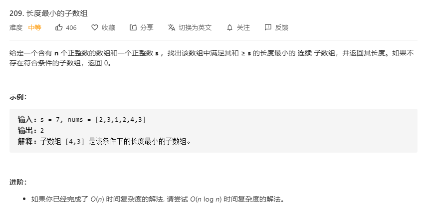

# 209.长度最小的子数组
  

```
/**
 * @param {number} s
 * @param {number[]} nums
 * @return {number}
 */
var minSubArrayLen = function(s, nums) {
    if(nums.length === 0) {
        return 0;
    }
    let res = Infinity, has = false;

    for(let i=0;i < nums.length-1;i++) {
        let temp = [], num = 0;
        for(let j=i;j<nums.length;j++) {
            temp.push(nums[j]);
            num += nums[j];
            if(num >= s) {
                if(temp.length < res) {
                    res = temp.length;
                    has = true;
                }
                break;
            }
        }
    }

    return has ? res : 0;
};
```

```
/**
 * @param {number} s
 * @param {number[]} nums
 * @return {number}
 */
var minSubArrayLen = function(s, nums) {
    if(nums.length === 0) {
        return 0;
    }
    let res = Infinity, i = 0, j = 0, temp = 0;

    while(j < nums.length) {
        temp += nums[j];

        while(temp >= s) {
            res = Math.min(res, j-i+1);
            temp -= nums[i];
            i++;
        }

        j++;
    }

    return res === Infinity ? 0 : res;
};
```