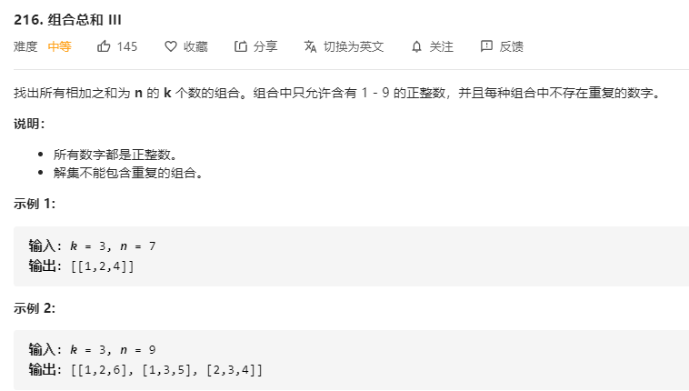

# 216.组合总和III
  

```
/**
 * @param {number} k
 * @param {number} n
 * @return {number[][]}
 */
var combinationSum3 = function(k, n) {
    let res = [];

    const mid = (temp, num, last) => {
        if(temp.length === k && num === n) {
            res.push(temp);
            return ;
        }

        if(temp.length > k || num > n) {
            return ;
        }

        for(let i=last;i<10;i++) {
            if(temp.indexOf(i) < 0) {
                temp.push(i);
                num += i;
                mid(temp.slice(0), num, i+1);
                temp.pop();
                num -= i;
            }
        }
    }

    mid([], 0, 1);

    console.log(res);

    return res;
};
```