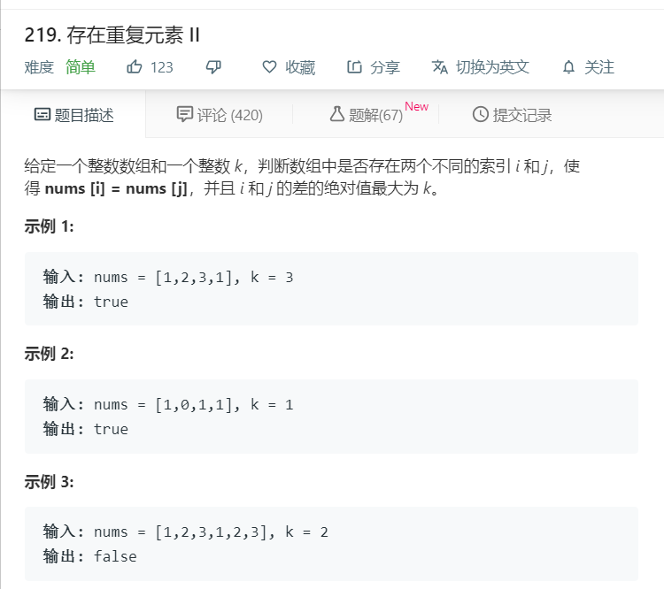

# 219.存在重复元素II
  

```
/**
 * @param {number[]} nums
 * @param {number} k
 * @return {boolean}
 */
var containsNearbyDuplicate = function(nums, k) {
  for(let i = 0;i<nums.length-1;i++){
    for(let j=i+1;j<nums.length;j++){
      if(nums[i]==nums[j] && j-i<=k){
        console.log(nums[i],nums[j],j-i);
        return true;
      }
    }
  }
  return false;
};
```

```
/**
 * @param {number[]} nums
 * @param {number} k
 * @return {boolean}
 */
var containsNearbyDuplicate = function(nums, k) {
    const set = new Set();
    for(let i = 0; i < nums.length; i++) {
        if(set.has(nums[i])) {
            return true;
        }
        set.add(nums[i]);
        if(set.size > k) {
            set.delete(nums[i - k]);
        }
    }
    return false;
};
```