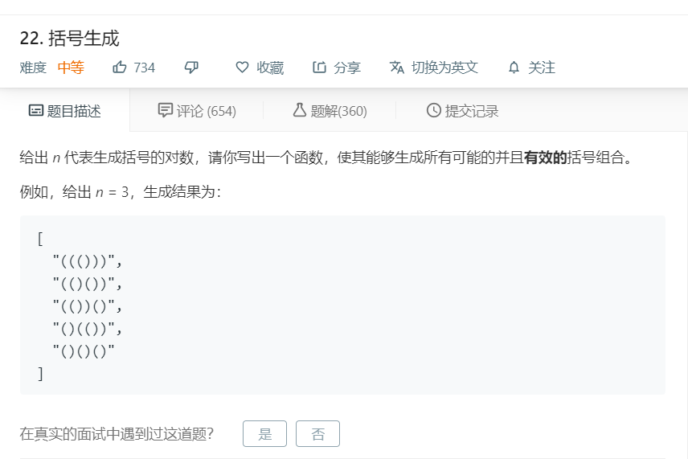

# 22.括号生成
  

```
/**
 * @param {number} n
 * @return {string[]}
 */
var generateParenthesis = function(n) {
    let temp = [],result = [];

    // 对于每个位置，至多有'('和')'这2种选择
    let one = (length,left,right,temp)=>{
        if(temp.length == length){
            result.push(temp.join(''));
            return ;
        }

        // 左括号：只要不够一半，就能够添加
        if(left < length/2){
            temp.push('(');
            one(length,left+1,right,temp.slice());
            temp.pop();

        }

        // 右括号：只要目前比左括号要少，就能添加
        if(right < left){
            temp.push(')');
            one(length,left,right+1,temp.slice());
            temp.pop();
        }
    }

    one(n*2,0,0,temp);

    return result;
};
```
## 递归
递归的时候列出所有可能性，同时如果已经不符合条件的就不进行递归，减少计算量
```
/**
 * @param {number} n
 * @return {string[]}
 */
var generateParenthesis = function(n) {
    const res = [];
    const mid = (now, left, right) => {
        if (left === n && right === n) {
            res.push(now);
        }

        if (left < n) {
            mid(now + '(', left + 1, right);
        }

        if (left > right && right < n) {
            mid(now + ')', left, right + 1);
        }
    }

    mid('', 0, 0);

    return res;
};

```