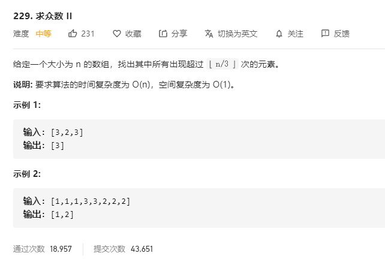

# 229.求众数II
  

```
/**
 * @param {number[]} nums
 * @return {number[]}
 */
var majorityElement = function(nums) {
    nums.sort((a,b)=>a-b);

    let mid = Math.floor(nums.length/3);

    let res = [];

    for(let i=0;i<nums.length;) {
        let temp = nums.lastIndexOf(nums[i]) - nums.indexOf(nums[i]);
        if(temp >= mid) {
            res.push(nums[i]);
        }
        if(temp != 0) {
            i += temp;
            i++;
        } else {
            i += 1;
        }
    }

    console.log(res);

    return res;
};
```