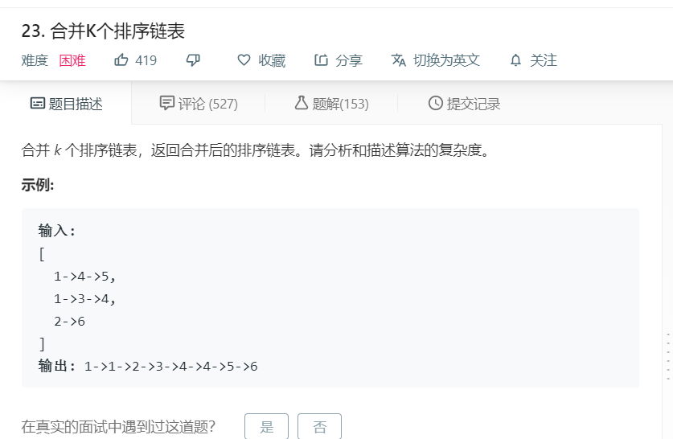

# 23.合并k个排序链表
  

```
/**
 * Definition for singly-linked list.
 * function ListNode(val) {
 *     this.val = val;
 *     this.next = null;
 * }
 */
/**
 * @param {ListNode[]} lists
 * @return {ListNode}
 */
var mergeKLists = function(lists) {
    let length = lists.length,temp=[],result=[],only=[];
    for(let i=0;i<length;i++){
        while(lists[i]){
            temp.push(lists[i].val);
            result.push(lists[i]);
            lists[i] = lists[i].next;
        }
    }

    if(temp.length == 0){
        return null;
    }
    let nowlength = result.length;
    while(only.length < nowlength){
        let num = temp.indexOf(Math.min(...temp));
        only.push(result[num]);
        if(only.length > 1){
            only[only.length-2].next = only[only.length-1];
        }
        temp.splice(num,1);
        result.splice(num,1);
    }
    if(only.length >= 1){
        only[only.length-1].next = null;
    }
    console.log(only);
    return only[0];
    
};
```